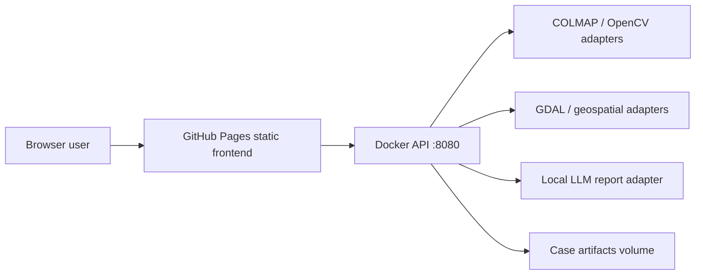

# Accident Reconstructor

https://baditaflorin.github.io/accident-reconstructor/

Browser-first vehicle accident reconstruction with 3D scene visualization, speed estimates, and evidence-ready reports.

This repository contains a GitHub Pages frontend and a Dockerized Go backend that orchestrates forensic reconstruction tools such as COLMAP, OpenCV-compatible adapters, GDAL, FFmpeg, and an optional local LLM.

## Quickstart

```sh
npm install
make build
make test
make smoke
make pages-preview
```

## Links

- Live site: https://baditaflorin.github.io/accident-reconstructor/
- Repository: https://github.com/baditaflorin/accident-reconstructor
- Support: https://www.paypal.com/paypalme/florinbadita
- ADRs: docs/adr/
- Deployment guide: docs/deploy.md

## Architecture

The frontend is a static Vite app published from `main` branch `/docs` on GitHub Pages. Heavy video processing runs in the Docker backend and is exposed as a REST API documented in `api/openapi.yaml`.



## Legal Note

This tool is an aid for organizing and explaining evidence. It does not certify legal admissibility, assign fault, or replace a qualified reconstruction expert.
