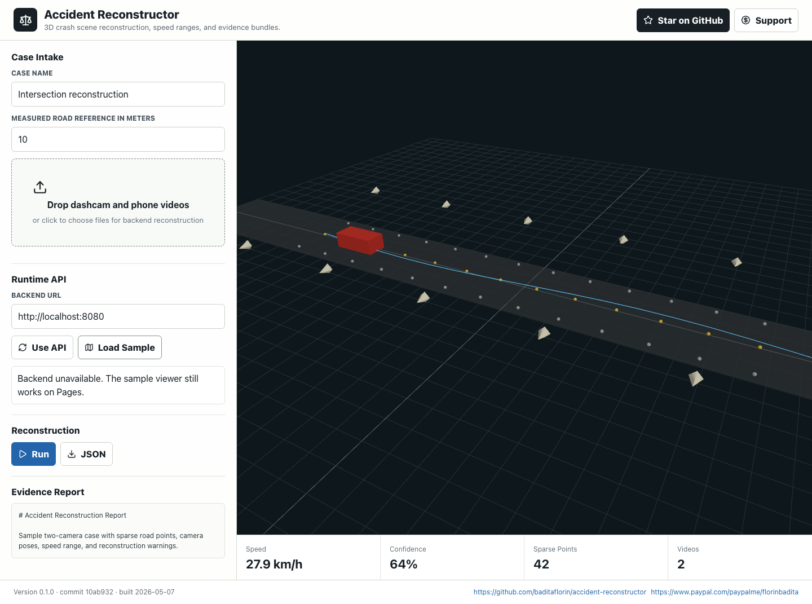
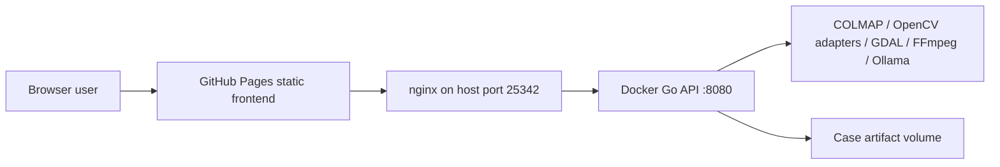

# Accident Reconstructor


Live site:

https://baditaflorin.github.io/accident-reconstructor/

Repository:

https://github.com/baditaflorin/accident-reconstructor

Support:

https://www.paypal.com/paypalme/florinbadita

Browser-first vehicle accident reconstruction with 3D scene visualization, speed estimates, and evidence-ready reports.

Accident Reconstructor lets a user drop dashcam and bystander phone videos into a static GitHub Pages app, submit them to a Dockerized Go reconstruction API, and inspect sparse 3D scene geometry, camera poses, vehicle tracks, speed ranges, toolchain warnings, and exportable evidence artifacts. It is a citizen-accessible decision-support tool, not a legal certification or fault assignment engine.



## Quickstart

```sh
npm install
make build
make test
make smoke
make pages-preview
```

## Backend

```sh
go run ./cmd/server
```

The API defaults to:

http://localhost:8080

The frontend API URL can be changed directly in the Runtime API field.

## Architecture



Architecture docs:

https://github.com/baditaflorin/accident-reconstructor/blob/main/docs/architecture.md

ADRs:

https://github.com/baditaflorin/accident-reconstructor/tree/main/docs/adr

API contract:

https://github.com/baditaflorin/accident-reconstructor/blob/main/api/openapi.yaml

Deploy guide:

https://github.com/baditaflorin/accident-reconstructor/blob/main/deploy/README.md

## Local Hooks

```sh
make install-hooks
```

The hooks run local checks only. This repository intentionally does not use GitHub Actions.

## Legal Note

This tool is an aid for organizing and explaining evidence. It does not certify legal admissibility, assign fault, or replace a qualified reconstruction expert.
