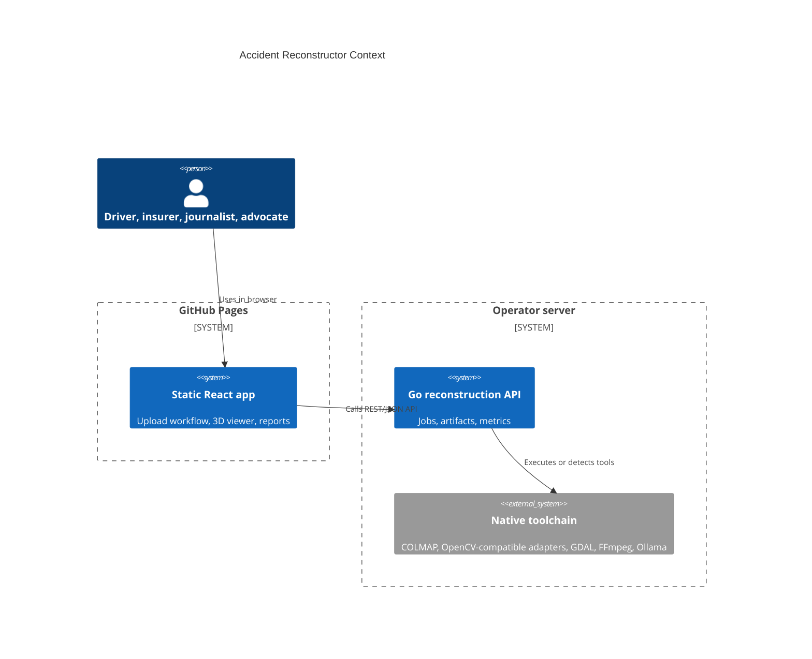
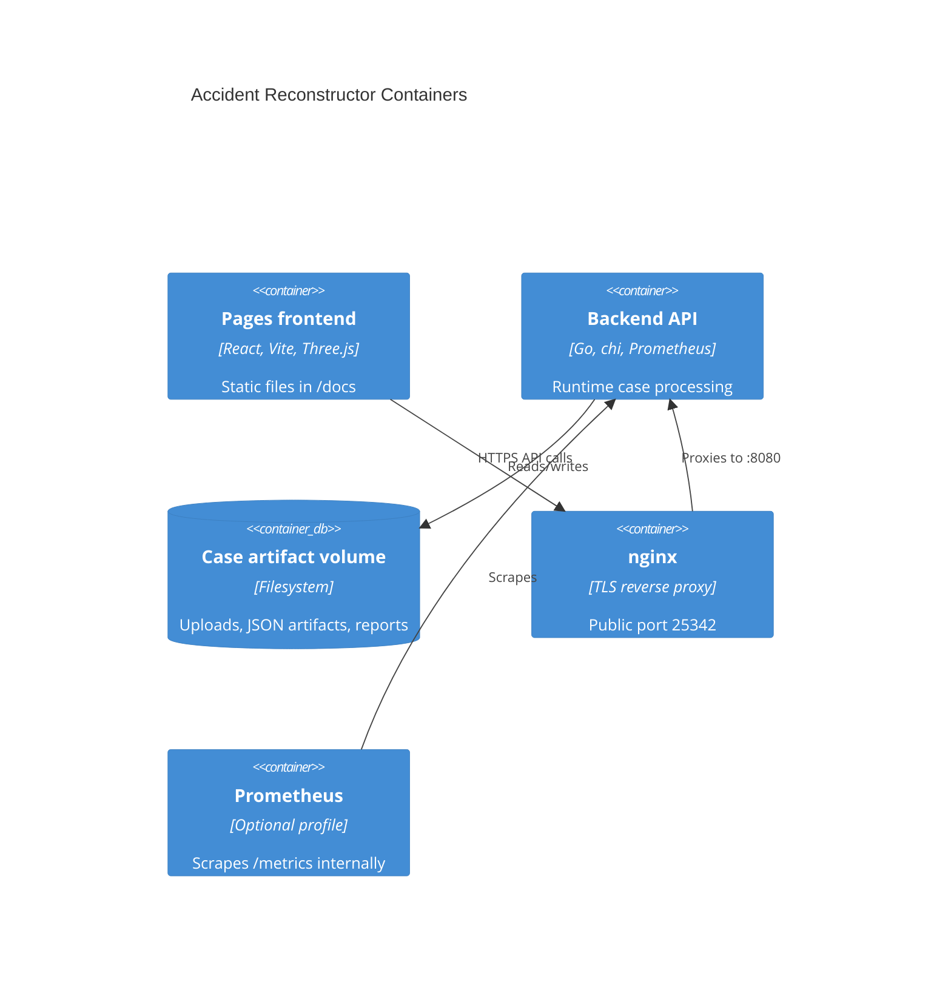

# Architecture

Frontend:

https://baditaflorin.github.io/accident-reconstructor/

Repository:

https://github.com/baditaflorin/accident-reconstructor

```mermaid
C4Context
  title Accident Reconstructor Context
  Person(user, "Driver, insurer, journalist, advocate")
  System_Boundary(pages, "GitHub Pages") {
    System(frontend, "Static React app", "Upload workflow, 3D viewer, reports")
  }
  System_Boundary(server, "Operator server") {
    System(api, "Go reconstruction API", "Jobs, artifacts, metrics")
    System_Ext(tools, "Native toolchain", "COLMAP, OpenCV-compatible adapters, GDAL, FFmpeg, Ollama")
  }
  Rel(user, frontend, "Uses in browser")
  Rel(frontend, api, "Calls REST/JSON API")
  Rel(api, tools, "Executes or detects tools")
```

```mermaid
C4Container
  title Accident Reconstructor Containers
  Container(frontend, "Pages frontend", "React, Vite, Three.js", "Static files in /docs")
  Container(api, "Backend API", "Go, chi, Prometheus", "Runtime case processing")
  ContainerDb(storage, "Case artifact volume", "Filesystem", "Uploads, JSON artifacts, reports")
  Container(nginx, "nginx", "TLS reverse proxy", "Public port 25342")
  Container(prom, "Prometheus", "Optional profile", "Scrapes /metrics internally")
  Rel(frontend, nginx, "HTTPS API calls")
  Rel(nginx, api, "Proxies to :8080")
  Rel(api, storage, "Reads/writes")
  Rel(prom, api, "Scrapes")
```
